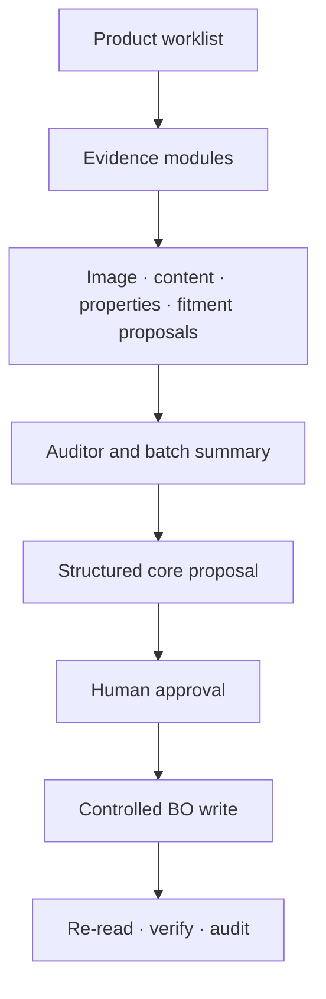

# Capability map

This public project is a safe, synthetic reconstruction of connected product-operations patterns. It does not copy an employer application, data model, source adapter or business rule.

| Visible module | What the demo actually does | Safety boundary demonstrated |
|---|---|---|
| Workspace | Selects one product state and exposes its completeness and workflow status | A single operational record is the source of the run |
| Product intake | Looks up a synthetic product code, exposes source fields and classifies an oil / cabin / air / fuel / hydraulic workflow with mode-specific checks | Unknown products are not inferred; contradictory evidence stops executable routing |
| Images | Queries the read-only Wikimedia Commons API for live candidates and metadata, applies resolution/framing rules, creates a browser-side manual square-frame preview, optionally replaces only edge-connected near-white pixels, and manages main/alternative order | Candidate evidence is separated from upload permission; no AI subject detection, detail generation or blanket background removal is claimed |
| Content | Exposes synthetic source text, extracts brand / part number / OEM availability, creates six editable template drafts and stages individual locales without writing the product record | Missing evidence remains missing; drafting is not a mutation |
| Properties | Converts raw synthetic product facts into canonical visible values | Unknown or unreviewed values remain explicit |
| Compatibility | Scores synthetic vehicle candidates and stages only `Ready` candidates | Ambiguous evidence is isolated for review |
| Batch runner | Validates a `forge-ops-import/v1` dry-run payload, reports paths/pills, loads only valid records, executes each declared allowlisted operation per SKU and verifies row outcomes | A batch does not absorb malformed or unknown records; failures remain isolated and retry only failed rows |
| Verify + Fix | Runs a read-only scan, preserves finding evidence, creates a controlled proposal only for allowlisted fields, then sends it through the existing BO verification flow | The audit cannot write; contradictory evidence stays blocked and verified findings disappear only after a new scan |
| Simulated BO | Performs controlled `GET → validate → PATCH allowlist → verify` against in-browser state | Approval, narrow writes and post-write verification |

## One product lifecycle

The product-facing modules prepare evidence and staged proposals. Only the controlled Back Office path mutates the core product state in this demo. That distinction is intentional: a polished draft, selected image or compatibility suggestion must not silently become a production write.
