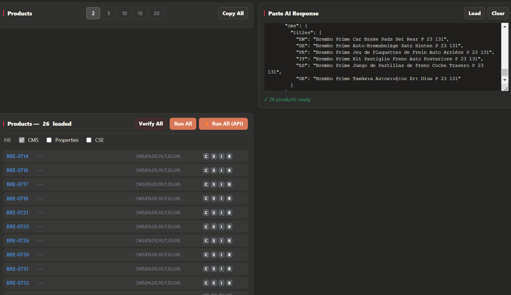
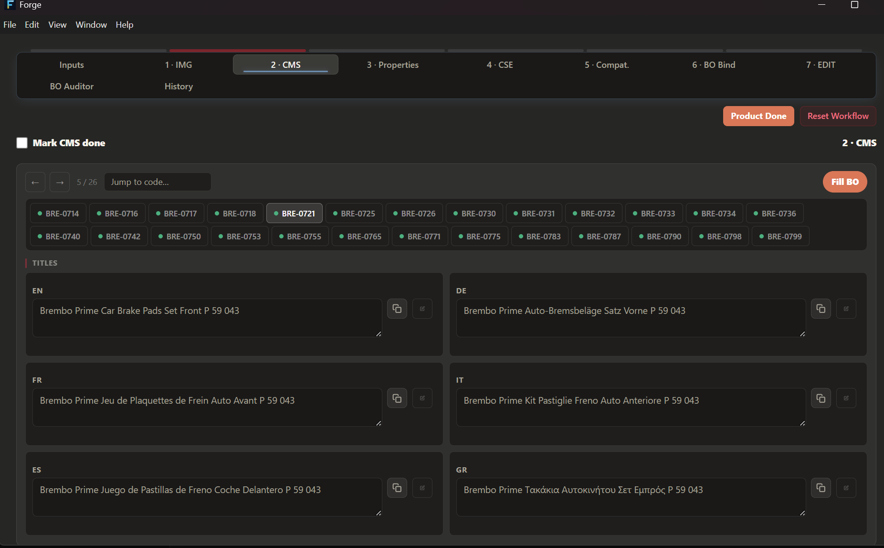
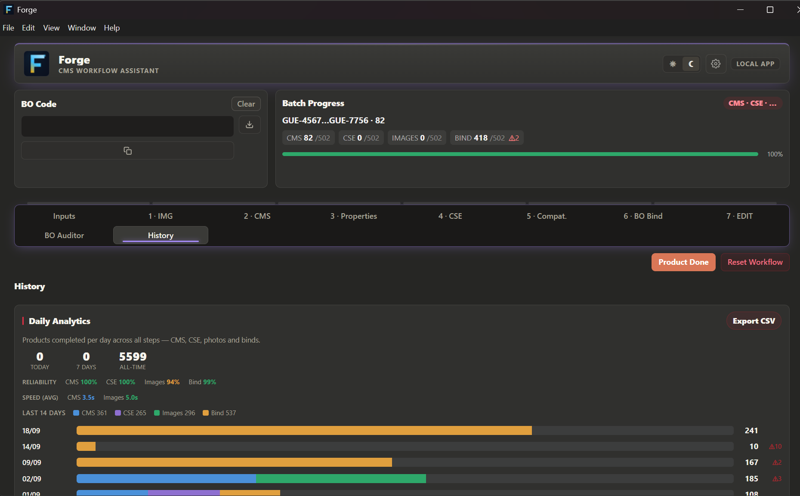

# Forge workflow in practice

These are screenshots of the internal Forge application. They show the operator path around a prepared batch. The runnable code in this repository is the independent, synthetic Agentic Ops Demo, which illustrates related controls developed further in Harness. The screenshots are evidence of the workflow interface and recorded activity; the repo does not contain Forge's source.

## 1. Load prepared JSON

The content is prepared elsewhere, then pasted into **Paste AI Response** and loaded. Forge reports **26 products ready**, shows the selected fields and languages for each product, and exposes batch actions.

## 2. Preview the product before filling BO

The operator selects a product pill and reviews its title fields across **EN, DE, FR, IT, ES, GR**. This is the review surface before pressing **Fill BO** for the selected product.

## 3. Check the History

The History tab displays recorded completion activity, reliability and average execution times by workflow step. It provides operational context for work completed through Forge. The aggregate view does not identify the exact product from the preview, so it should not be read as a per-product receipt.

**Boundary:** JSON generation/preparation happens outside Forge. The UI shown here handles import, preview and BO filling. Agentic Ops Demo models related operational controls with synthetic fixtures and simulated BO writes.
